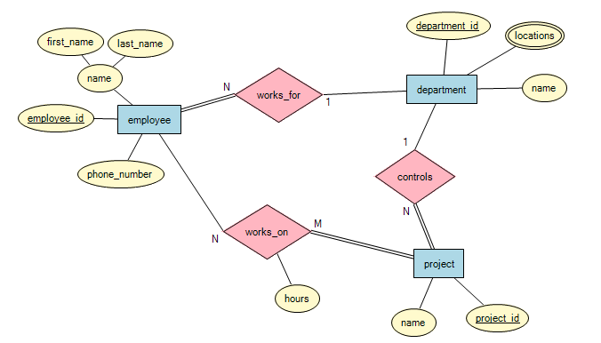
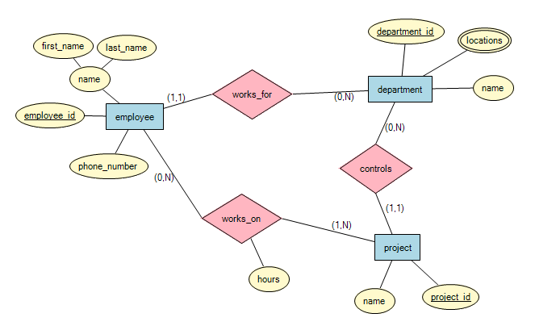

# PostgreSQL Project
## Small Company Database
#### Αλέξανδρος Στολτίδης (2824)

## Contents
### Tables and Relations

* Entity Relationship (ER) Representation

* Relational Data Mapping

* 3NF and BCNF

### Microsoft Access
* Tables and Forms
* Reports and Switchboard

### Additional Information

Upcoming Update Features

Sources and Studying Material


## Files and Installation
### File Structure
* **Database** or **Database.accdb**: MS-ACCESS Tables, Queries, Forms, Reports
    and Switchboard
* **Diagrams** (Directory)
    * **ER_Diagram** or **ER_Diagram.erx** : Entity Relationship (ER) Diagram
    * **RDM** or **RDM.draw.io** : Relational Data Mapping (RDM) Diagram
* **Images** (Directory)
    * **Database_Forms** or **Database_Forms.png** : MS-ACCESS Forms
    * **Database_Reports** or **Database_Reports.png** : MS-ACCESS Reports
    * **Database_Tables** or **Database_Tables.png** : MS-ACCESS Tables
    * **ER_basic_notation** or **ER_basic_notation.png** : Basic ER Diagram
    * **ER_min_max** or **ER_min_max.png** : ER Diagram with (min, max)
    * **RDM** or **RDM.png** : Relational Data Mapping Diagram
* **Project Instructions** (Directory)
    * **Instructions** or **Instructions.pdf** : Project Instructions
    * **Installation Guide** or **Installation Guide.pdf** : Installation Instructions
       for PostgreSQL, ODBC Driver and MS-ACCESS Connection

## Installation
* For Relational Data Mapping (RDM) Diagrams Install Draw.io or Open From
Browser with https://app.diagrams.net/
* For PostgreSQL and MS-ACCESS Follow the Instructions on **Installation Guide**

## Execution
1. Open Database or Database.accdb with Microsoft Access
2. Go to Forms→Switchboard, Right Click and Open
    * If you have an ODBC Installed Run Queries with Pass-Through


## Small Company Database

### Basic Structure and Data

A company consists of many **Departments** , **Employees** and **Projects**

<pre>
<b>Department’s Attributes</b>
Name
</pre>

<pre>
<b>Employee's Attributes</b>
First Name
Last Name
Phone Number
</pre>

<pre>
<b>Project's Attributes</b>
Name
</pre>

## Database Relations

1. A **Department** can, but is not necessary, to have many **Employees** (0, N)
2. A **Department** can, but is not necessary, to control many **Projects** (0, N)
3. An **Employee** must necessarily work for only one **Department** (1,1)
4. An **Employee** can, but is not necessary, to work on Many **Projects** (0, N)
5. A **Project** must be controlled by only one **Department** (1, 1)
6. A **Project** must be developed by at least one **Employee** (1, N)


## Entity Relationship (ER) Representation
### Instructions to Open the ER Diagram
1. On Submit Folder Search for the File **Diagrams/ER_Diagram** or for **Diagrams/ER_Diagram.erx**
2. Download and Launch ER2SQL
3. On **ER2SQL** go to **File** → **Open** and Select the **Diagrams/ER_Diagram** or the **Diagrams/ER_Diagram.erx**

### ER Diagram (Basic Notation)


### ER Diagram ((min, max) Notation)


## Relational Data Mapping
## Instructions to Open the Relational Data Mapping Diagram
Download and Install Or Open Online Draw.io from https://app.diagrams.net/

### Online Driver
Open Existing Diagram or **File → Open from → Device** and Select Diagrams/RDM or Diagrams/RDM.draw.io

### Downloaded Program

**File → Open** and Select **Diagrams/RDM** or **Diagrams/RDM.draw.io**

## Relational Data Mapping Diagram Relations


## 3NF and BCNF
### Employee Table
<pre>
<b>employee_id</b> first_name last_name phone_number <b>department_id</b>
</pre>

### Department Table
<pre>
<b>department_id</b> name
</pre>

### Locations Table

<pre>
<b>employee_id</b> name
</pre>

### Project Table

<pre>
<b>project_id</b> name <b>department_id</b>
</pre>

### Employees – Projects (works-on) Table

<pre>
<b>employee_id</b> <b>project_id</b> hours
</pre>

## 3NF Criteria
```
1. Must be in 1NF
2. There are NO Transitive Dependencies
```

_All Above Tables Indicate that all 3NF Criteria are Valid_
1) There are no Transitive Dependencies since Non-Prime Attributes Depend
Only on Prime Attributes (Primary Keys)
2) Are in 1NF

- All Columns of each Table have Different Column Names
- Every Cell Can Store Single Values
- All Inputs in the Same Column have the Same Format

## BCNF Criteria

```
1. Must be in 3NF
2. If A → B then A must be a Super Key (If A Derives B and B is a Prime Attribute A Can Not be a NON-Prime
Attribute)
```
_All Above Tables Indicate that all BCNF Criteria are Valid_
1) All Above Tables are in 3NF
2) No Prime Attribute is Derived by a Non-Prime Attribute


## Database with MS Access

### Tables

- **Departments**
- **Employees**
- **Locations** (Attached to **Departments** )
- **Projects**
- Work On (Relationship Between **Employees** and **Projects** )
- Switchboard Items (Used for Switchboard)

### Forms

- **Departments Form** to Insert a Department
- **Locations Form** to Insert a Location
- **Projects Form** to Insert a Project
- **Employees Form** to Insert an Employee
- **Working Project Form** to Assign Project to Employee
- **Switchboard** to Control All Forms Above


### Reports

- **Employees and Projects** : Displays Employee’s Info and the Name of the Project the
    Employee is working on
- **Employees and Departments** : Displays Employee’s Info and the Name of the
    Department the Employee is working for
- **Departments and Projects** : Displays Department’s Name and the Name of the
    Project the Department Controls
- Departments Table: Displays all Departments
- Locations Table: Displays all Locations
- Projects Table: Displays all Projects
- Employees Table: Displays all Employees

### Switchboard and Database

### Open Switchboard

On Microsoft Access

1. **Forms → Switchboard** (Right Click → Open)
2. Navigate Options Connected to Forms
(Note: Maintain Data Option Feature is to be Added on Future Versions)


## Upcoming Update

- Connect Database to a Node.js API with “pg” Driver to get rid of MS-ACCESS
- Implement Delete and Maintain Queries to Accomplish a Complete Database
    Functionality (CREATE, INSERT, UPDATE, DELETE)
- Create a Trigger to Randomize IDs if they are not Specified, like MongoDB
    Does
- Create a Super-Class Person to Overlap or Disjoint with the Different
    Employees the Company may have

## Sources and Studying Material

[Relational Data Mapping](https://www.youtube.com/watch?v=CZTkgMoqVss)

[ACCESS Forms](https://www.youtube.com/watch?v=dEaQIrw3CZY)

[ACCESS Reports](https://www.youtube.com/watch?v=1XUeGq80R5Q&t=55s)

[ACCESS Switchboard](https://www.youtube.com/watch?v=NF2GSvzV7qg&t=163s)

[3NF](https://www.youtube.com/watch?v=aAx_JoEDXQA)

[BCNF](https://www.youtube.com/watch?v=NNjUhvvwOrk&t=103s)

